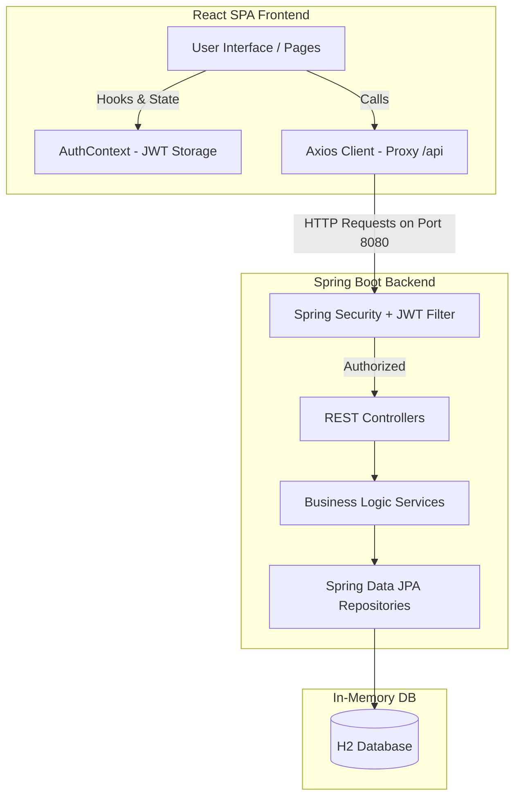

# 📦 Inventory Management System (IMS)

A modern, full-stack, enterprise-grade **Inventory Management System** designed to streamline stock tracking, transaction requisitions, low-stock alerting, and warehouse analytics. Built with a robust **Spring Boot** secure backend and a rich, responsive **React + TypeScript** frontend with real-time analytics.

---

## 🏗️ Architecture & Flow Overview

The system uses a decoupled client-server architecture where a secure React SPA interacts with a Spring Boot REST API using JWT (JSON Web Tokens) for stateless authentication.



---

## ✨ Key Features

### 🔐 Secure Multi-Role Authentication
- **Token-Based Authentication:** Uses secure JSON Web Tokens (JWT) for all API communication.
- **Admin Portal (`ROLE_ADMIN`):** Unlocks complete system access including inventory tracking, detailed transaction histories, financial analytics, product management, and stock adjustments.
- **User Portal (`ROLE_USER`):** Offers a streamlined experience for requesting items, registering stock allocations, and verifying item availability.

### 📊 Real-Time Analytics & Dashboard
- **Key Performance Indicators (KPIs):** Displays total items in stock, current estimated inventory valuation, active low-stock triggers, and transaction frequencies.
- **Visual Trends:** Interactive charts showing stock status distribution and activity history utilizing custom-styled Recharts.

### 📂 Unified Product Catalog
- **SKU Generation:** Standardized stock-keeping unit tracking.
- **Dynamic Cataloging:** Complete CRUD actions to create, update, search, and delete catalog items.
- **Status Badges:** Color-coded status labels (`In Stock`, `Low Stock`, `Out of Stock`) automatically updated by backend calculations.

### 📍 Warehouse Stock & Location Allocation
- **Multi-Location Storage:** Supports distinct storage yards/warehouses (e.g., "Main Storage", "IT Department Support").
- **Stock Movements:** 
  - **Stock In:** Increase quantities directly at selected locations.
  - **Internal Transfers:** Logically move units from one storage zone to another while keeping a secure audit trail.

### 🧾 Transaction Audit Ledger
- **Automatic Adjustments:** Processing transactions (sales, internal requisitions) automatically increments/decrements inventory.
- **Requisition Ledger:** Generates structured transaction IDs (e.g. `TXN-XXXXX`) detailing requestor names, target departments, and item list details.

---

## 🛠️ Technology Stack

| Layer | Technologies Used |
| :--- | :--- |
| **Frontend** | React 19, TypeScript 6, Vite 8, React Router DOM v7, Recharts, Lucide Icons, Axios |
| **Backend** | Java 17, Spring Boot 3.3.2, Spring Security (with Custom JWT Filter), Spring Data JPA, Lombok |
| **Database** | H2 In-Memory Database (with automated schema generation and data seeding) |
| **Testing** | Cypress (E2E Integration Testing), JUnit 5 (Backend Integration & Service Testing) |

---

## 🚀 Getting Started

Follow these step-by-step instructions to get the backend, frontend, and tests up and running on your local machine.

### 📋 System Prerequisites
Make sure you have the following installed:
- **Java Development Kit (JDK) 17** or higher.
- **Node.js** (v18 or higher recommended) and **npm** (v9 or higher).
- A modern web browser.

---

### 1. ⚙️ Running the Backend Server

The backend runs on **Spring Boot** and utilizes an in-memory **H2 Database**. It automatically handles schema generation and seeds a default administrative user on startup.

1. Open a terminal and navigate to the `demo` directory:
   ```bash
   cd demo
   ```
2. Run the Spring Boot application using the provided Maven wrapper:
   * **Windows (PowerShell/CMD):**
     ```powershell
     .\mvnw.cmd spring-boot:run
     ```
   * **macOS/Linux:**
     ```bash
     chmod +x mvnw
     ./mvnw spring-boot:run
     ```
3. The server will start on **`http://localhost:8080`**.
4. **H2 Console access:** You can inspect database tables by navigating to `http://localhost:8080/h2-console` with:
   - **JDBC URL:** `jdbc:h2:mem:demo`
   - **Username:** `sa`
   - **Password:** `password`

> [!NOTE]
> On server startup, a default administrative user is automatically seeded:
> - **Username:** `admin`
> - **Password:** `admin123`

---

### 2. 💻 Running the Frontend Client

The frontend is a **Vite + React** single page application. In development, Vite's built-in dev proxy automatically forwards all client API requests starting with `/api` to the backend on `http://localhost:8080`.

1. Open a new terminal window and navigate to the `interface` directory:
   ```bash
   cd interface
   ```
2. Install the frontend dependencies:
   ```bash
   npm install
   ```
3. Start the Vite development server:
   ```bash
   npm run dev
   ```
4. The development environment will open at **`http://localhost:5173`** (or another port if 5173 is occupied). Open this URL in your web browser.

---

## 🧪 Testing the System

Both layers feature dedicated integration tests to verify critical logic and system behavior.

### ☕ Running Backend Unit & Integration Tests
The backend uses JUnit 5 for transactional integration tests, verifying inventory status updates, automatic stock decrements upon sale, and database seeder logic.

1. Navigate to the `demo` directory:
   ```bash
   cd demo
   ```
2. Run all tests:
   ```bash
   .\mvnw.cmd test
   ```

### 🌲 Running Cypress End-to-End Tests
The frontend features Cypress E2E tests validating the full Authentication flow (success & failure states), requesting items as a standard user, side navigation access, and user logout procedures.

1. Navigate to the `interface` directory:
   ```bash
   cd interface
   ```
2. Ensure you have installed all node modules, then execute:
   * **Interactive mode (Cypress Test Runner App):**
     ```bash
     npm run cypress:open
     ```
   * **Headless CLI mode:**
     ```bash
     npm run cypress:run
     ```

---

## 📂 Project Structure

```hl
InventoryManagementSystem/
├── demo/                       # Spring Boot Backend API
│   ├── .mvn/                   # Maven Wrapper configuration
│   ├── src/
│   │   ├── main/
│   │   │   ├── java/com/example/demo/
│   │   │   │   ├── controller/ # REST Endpoints (Products, Inventory, Transactions, Auth)
│   │   │   │   ├── dto/        # Request/Response Data Transfer Objects
│   │   │   │   ├── models/     # JPA Entities (User, Product, Inventory, Transaction)
│   │   │   │   ├── repository/ # Spring Data JPA Repository interfaces
│   │   │   │   ├── security/   # Security Configuration & JWT Filters
│   │   │   │   ├── services/   # Business Logic Implementations
│   │   │   │   ├── DemoApplication.java # Spring Boot entry point [FIXED]
│   │   │   │   └── DataSeeder.java      # Seeder for admin account
│   │   │   └── resources/
│   │   │       └── application.properties # H2 & database configs
│   │   └── test/               # JUnit backend integration tests
│   └── pom.xml                 # Maven dependency management
│
└── interface/                  # Vite + React Frontend Client
    ├── cypress/                # Cypress E2E test files
    ├── src/
    │   ├── api/                # Axios instance & typed backend callers
    │   ├── assets/             # Images and SVG icons
    │   ├── components/         # Reusable widgets, Modals, Page Layout wrapper
    │   ├── context/            # Global React Contexts (Auth, Modals, Toasts)
    │   ├── pages/              # UI Pages (Dashboard, Inventory, Login, Transactions)
    │   ├── App.tsx             # Application router & layout wrapping
    │   └── main.tsx            # DOM root registration
    ├── vite.config.ts          # Vite bundle & dev server /api proxy setup
    └── package.json            # Node project configuration
```

---

## 🛠️ Verification Logs & Troubleshooting

* **Backend Compilation Fails?** We discovered that the core `DemoApplication.java` entry point class was missing from the backend files. We have created and restored it under `demo/src/main/java/com/example/demo/DemoApplication.java`. The system now compiles perfectly.
* **Cypress base URL issue?** Ensure your dev server is running at the configured URL in `cypress.config.ts` (usually `http://localhost:5173`).
